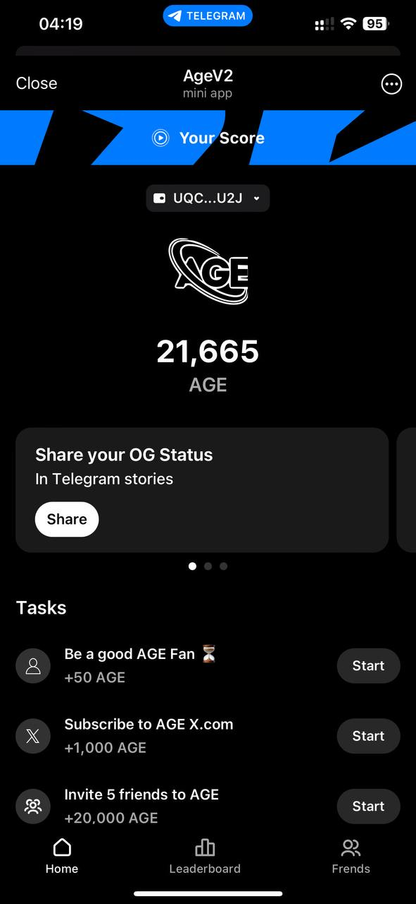

# DogHouse Telegram Bot Clone Source Code [AgeCoin](https://t.me/AgeCoinBot)

# Come To my Telegram Channel to see another projects : [osClub](https://t.me/osClub)

# [AgeCoinBot](https://t.me/AgeCoinBot)

[AgeCoinBot](https://t.me/AgeCoinBot) Bot is a powerful and interactive AirDrop cryptocurrency bot that allows users to collect points by inviting their friends (referrals) and completing daily activities within the bot. This bot is built using HTML, CSS, JavaScript, and PHP and includes a comprehensive admin panel for managing users, activities, and other functionalities.

## Features

- **Authorization via Telegram**: Full authentication of the user is done by Telegram web services and there is no possibility of cheat.
- **Mobile Adaptation**: Fully responsive and compatible with all types of mobile phones.
- **DDoS Protection (CloudFlare)**: Have a DNS protection system.
- **Referral System**: Users can earn additional points by inviting others to join and play the game.
- **Daily Activities**: Users can complete daily activities to earn more points.
- **Admin Panel**: A full-featured admin panel to manage users, activities, and view detailed statistics.
  - **User Management**: Search users by (UserID|Name|Username) and change all user item values.
  - **Task Management**: Create|Delete missions and for each missions Create|Delete Tasks (There is two types of tasks : JoinChat|VisitWebsite).
  - **Statistics**: View detailed statistics about user engagement and activity performance.
  - **BackUP**: Get database backup.
  - **Maintenance Mode**: Temporary and timed shutdown of the robot (with a dedicated page).

## bot Previews

  

## Technologies Used

- **Frontend**: HTML, CSS, JavaScript
- **Backend**: PHP, mySQL

## Pricing

This script is available for purchase at **$500** With Full Customization ! 
📛 Pay First 📛 
📛 Scammers Not Come !!! 📛

## Buying

Contact Me In Telegram : <a href="https://t.me/LampStack">@LampStack</a> 

## License

This project is licensed under the MIT License. See the [LICENSE](LICENSE) file for more details.

## Contact

<a href="https://t.me/LampStack">Telegram</a> 
<a href="mailto:xialop@outlook.com">Email</a>
